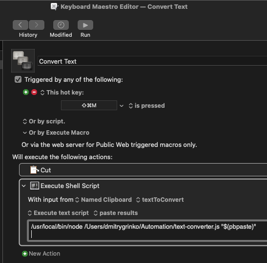

# Converter
It is a js script to fix text, in case you accidentally used the wrong keyboard layout for typing.
It supports only English and Russian layouts.
I'm using this script with Keyboard Maestro -

/usr/local/bin/node /Users/<user>/Automation/text-converter.js "$(pbpaste)"

